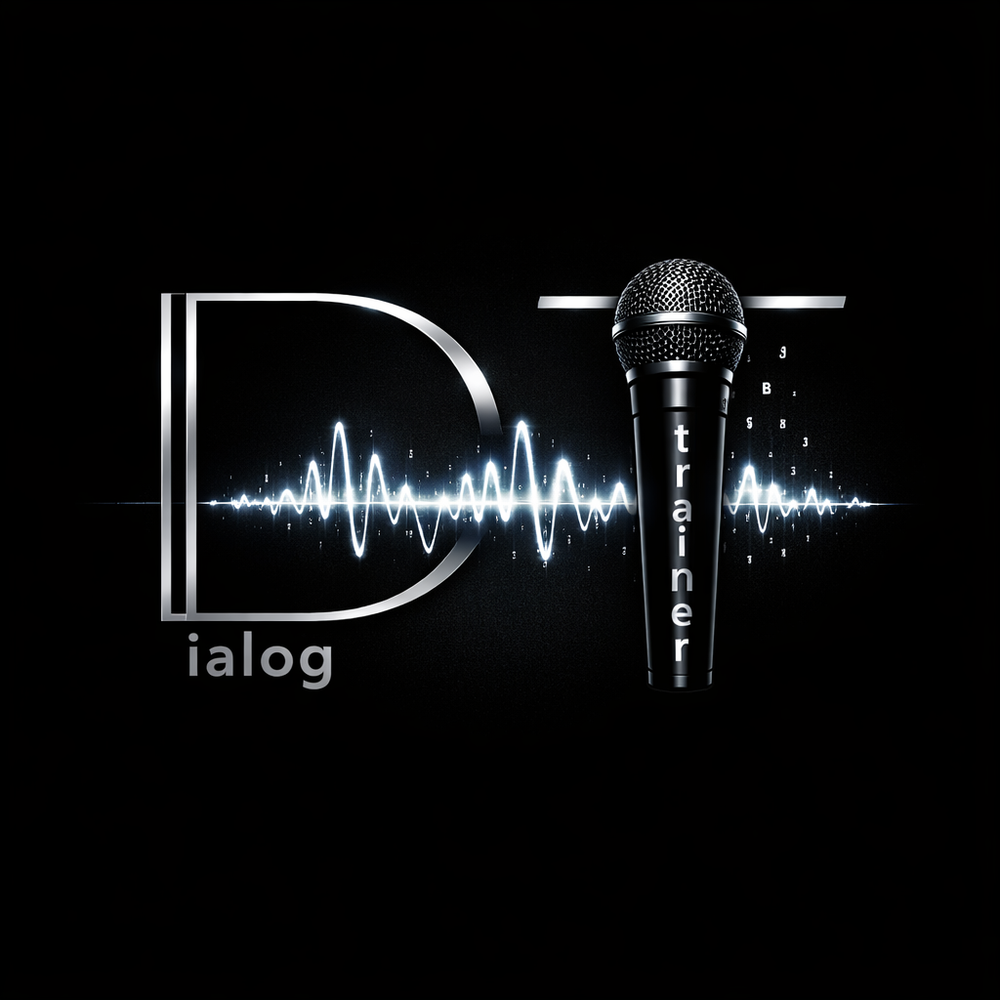
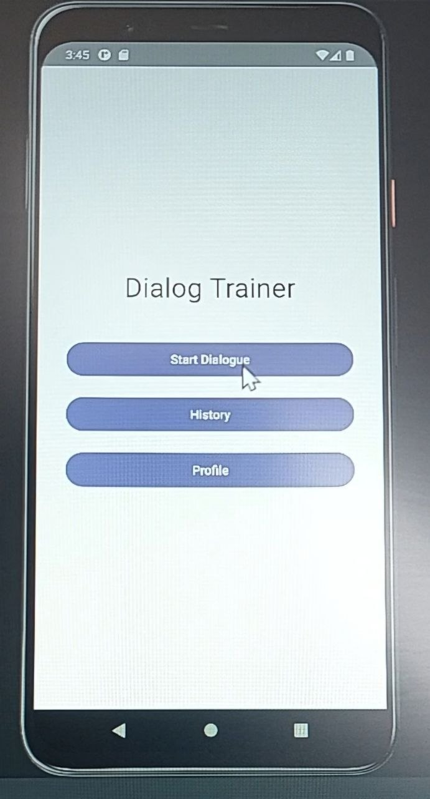
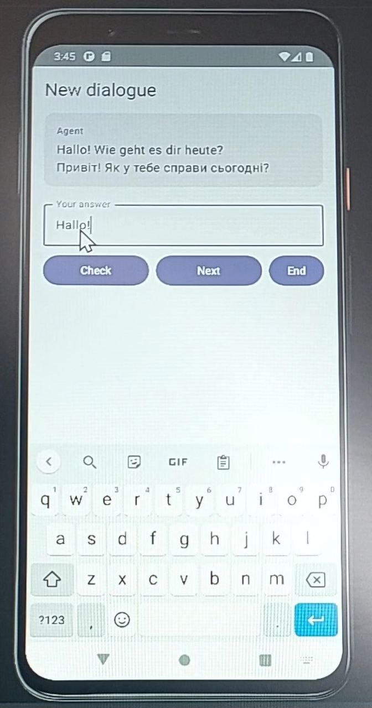
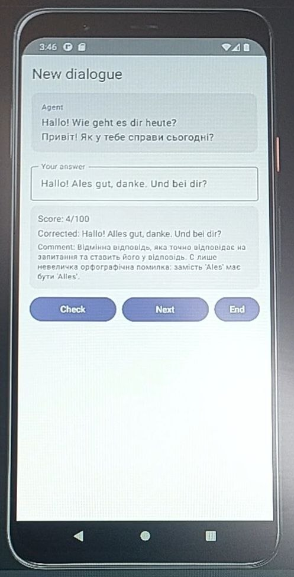
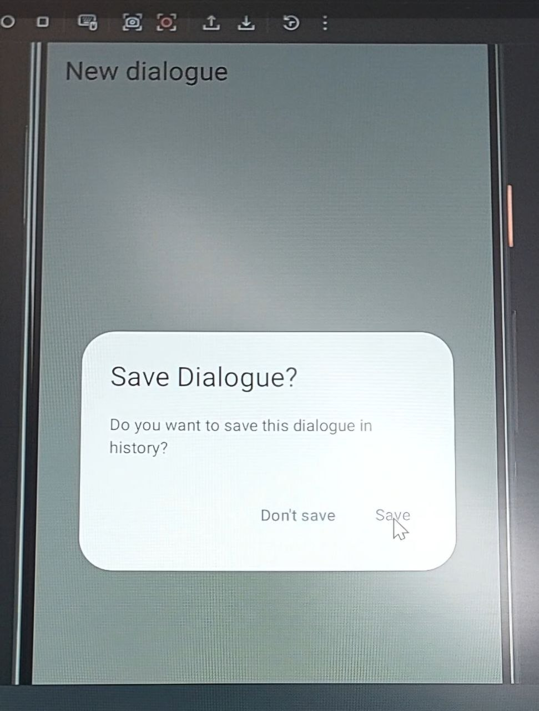
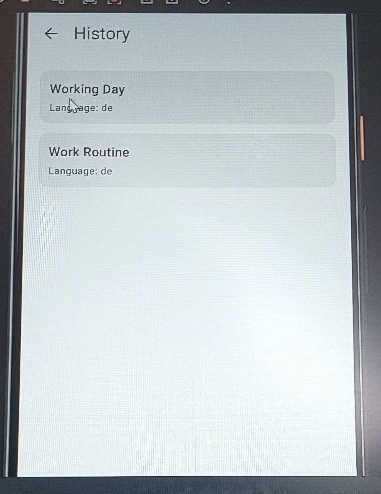
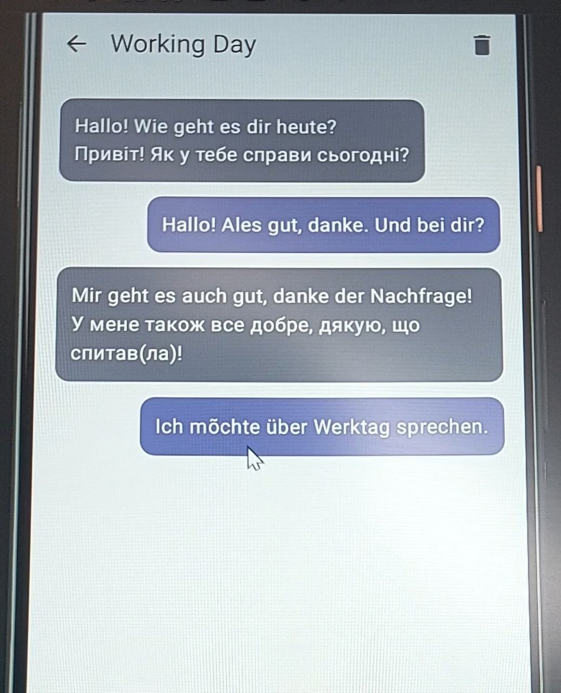

  

<h1 align="center">DialogTrainer</h1>

AI‑powered language dialogue app

  
  
  
  
  

---

# 📸 Screenshots

### 🏠 1. Home Screen

### 💬 2. New Dialogue — First AI Message

### ✍️ 3. New Dialogue — User Answer + AI Feedback

### 💾 4. Save Dialogue Prompt

### 📚 5. History — Saved Dialogues List

### 📖 6. Saved Dialogue — Full Conversation View

---

# ✨ Key Features
- 🗣️ AI‑generated dialogues in your learning language
- 🔤 Automatic translation into your native language
- ✍️ Smart evaluation: corrected answer, score, comment
- 🔄 Continue or finish the dialogue anytime
- 💾 Save full conversations to History
- 🧠 Auto‑generated titles based on topic
- 🧹 Clean and intuitive UI

---

# ⚙️ How it works
1. Start a dialogue → AI sends the first message
2. Write your answer → AI evaluates it
3. Continue the conversation
4. Save the dialogue
5. View it anytime in History

---

# 🛠 Tech Stack
- Kotlin
- Jetpack Compose
- MVVM + StateFlow
- Room Database
- Gemini API
- Material 3

---

# 🔑 API Key Setup

Create a Gemini API key:  
https://console.cloud.google.com/apis/credentials

Add it to your project:

GEMINI_API_KEY=your_key_here

--

### Overview
**DialogTrainer** is a mobile app designed to help learners practice real-life foreign languages through interactive dialogs, scenes, and role-based conversations.  
The app focuses on speaking, writing, and understanding in natural, everyday contexts.  
The first version centers on German, but the app is built to support multiple languages as it grows: from simple phrases → to full dialogs → to a personal phrase library.

### Features
- Interactive dialogs with multiple roles
- Scene-based learning (shops, travel, work, daily life)
- Speaking and writing practice
- Messenger-style interface
- Personal phrase library (planned)
- Offline-friendly architecture (planned)

### Project Status
Active development. The app is currently in an early prototype stage and will gradually expand with new dialogs, scenes, and learning modes.

### License
This project is licensed under **CC BY-NC-ND 4.0**.  
Commercial use, modification, or redistribution of modified versions is not permitted.  
Full license text is available in the `LICENSE` file.

### Roadmap
- Dialog engine v1
- Scene selection UI
- Role-based speaking mode
- Phrase library
- Audio support
- Export/import user progress
- Release on Google Play

